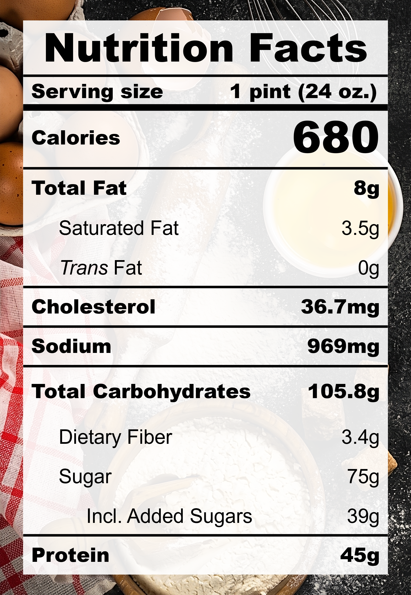

| **Taste** | **Macros** | **Ease** |
| :---: | :---: | :---: |
| ★★★★☆ | ★★★☆☆ | ★★★☆☆ | 

## Recipe

**Ingredients for a 24-oz pint:**
- Strawberry fruit spread (3 tbsp)
- Guava fruit spread (1 tbsp)
- Instant pudding, zero sugar, cheesecake (14 g)
- Salt (&frac18; tsp)
- Monkfruit sweetner with allulose (1 tsp)
- Vanilla extract, pure (1 tsp)
- Milk, 0% fat, ultra-filtered (1 &frac12; cups)
- Greek yogurt, nonfat, plain (&frac12; cup / 115 g)
- Cottage cheese, lowfat 2% milkfat, small curd (&frac12; cup / 119 g)
- Lotus Biscoff cookies (2 cookies)
- Lime zest and juice (1 lime)
- Strawberry, fresh (12 strawberries)

**Instructions:**
1. Blend everything except half of the fruit spread, Lotus Biscoff cookies, lime, and fresh strawberries together.
2. Freeze for 24 hours.
3. Spin on LITE ICE CREAM.
4. Squeeze in the lime juice, and add the other half of the fruit spread and the Lotus Biscoff cookies (broken into halves), spin on MIX-IN.
6. Top with lime zest and fresh strawberries.

## Nutrition Facts

## Reflections

**Overall Rating:** ★★★★☆

Wow, I'm genuinely impressed by how the flavours came together! I wanted to get a little fancy with the fresh strawberries and lime zest, and it was definitely worth the effort. Fragrant, fresh, sweet, tangy, and rich, this pint perfectly captures the essence of a decadent slice of cheesecake. First recipe to make Celine's Choice!

**The Good (what went well):**
- Fresh strawberries are so good: In general, fresh fruits are a great way to add volume, flavour, and fiber into an icy dessert.
- Cheesecake flavour did not taste artifical: The secret was pure vanilla extract!
- The lime zest was worth the effort: For the citrus lovers, a sprinkle of zest on top delivers a fresh aroma and a pop of contrast that cuts through the richness of the cream.

**The Bad (lessons learned):**
- The Lotus Biscoff cookies were pulverized: Manually mix into the ice cream to get bit sized pieces.
- The yogurt flavour was noticeable: Did not successfully trick my brain into believing that Greek yogurt was the next cream cheese. Use cream cheese for a more authentic cheesecake flavour.
