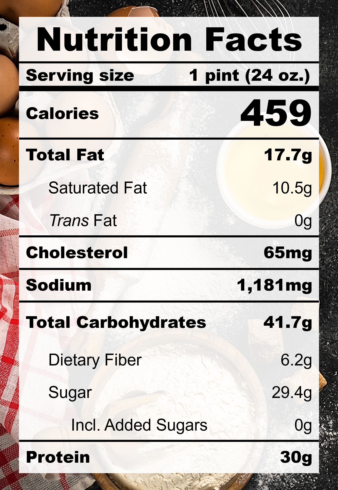

| **Taste** | **Macros** | **Ease** |
| :---: | :---: | :---: |
| ★★★☆☆ | ★★★☆☆ | ★★★★☆ | 

## Recipe

**Ingredients for a 24-oz pint:**
- Strawberry, fresh (316 g)
- Cream cheese, light (&frac14; cup)
- Cottage cheese, lowfat 2% milkfat, small curd (&frac12; cup)
- Milk, 2% fat, ultra-filtered (1 cup)
- Vanilla extract, pure (1 tsp)
- Lemon juice (2 tsp)
- Salt (&frac18; tsp)
- Monkfruit sweetner with allulose (&frac14; cup)
- Xanthan gum (&frac14; tsp)

**Instructions:**
1. Blend everything together.
2. Freeze for 24 hours.
3. Spin on LITE ICE CREAM (push down and re-spin with a splash of milk if needed).

## Nutrition Facts

## Reflections

**Overall Rating:** ★★★★☆

I wanted to make a creamier pint of strawberry cheesecake ice cream by using real cream cheese instead of the cheesecake instant pudding. Fresh strawberries were added directly to the pint for a fresh fruity taste. The overall flavour was decent but it felt a bit flat.

**The Good (what went well):**
- Strong strawberry aroma and taste: The fresh strawberries were very tasty and added a vibrant pint colour to the pint.

**The Bad (lessons learned):**
- Not enough cheesecake flavour: I'll add back the cheesecake instant pudding mix next time. The cream cheese itself wasn't enough to provide the full flavour.
