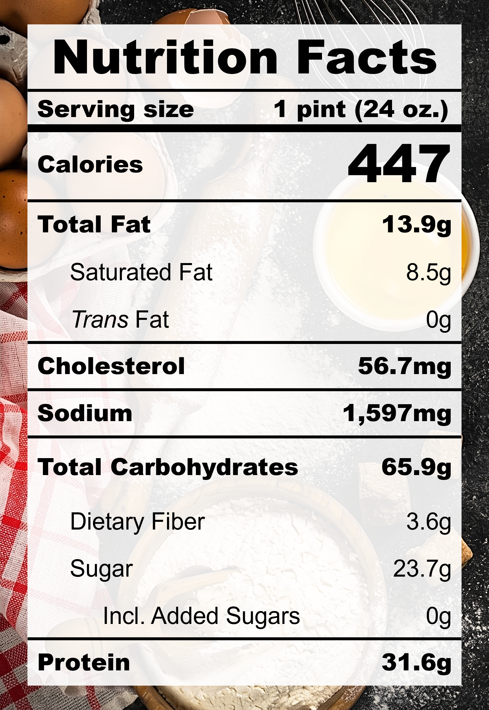

| **Taste** | **Macros** | **Ease** |
| :---: | :---: | :---: |
| ★★★★☆ | ★★★★☆ | ★★★★☆ | 

## Recipe

**Ingredients for a 24-oz pint:**
- Strawberry, fresh (200 g)
- Cream cheese, light (2 tbsp)
- Cottage cheese, lowfat 2% milkfat, small curd (&frac12; cup)
- Milk, 2% fat, ultra-filtered (1 &frac13; cup)
- Vanilla extract, pure (1 tsp)
- Lemon juice (1 tbsp)
- Salt (&frac18; tsp)
- Monkfruit sweetner with allulose (2 tbsps)
- Instant pudding, zero sugar, cheesecake (14 g)

**Instructions:**
1. Blend everything together.
2. Freeze for 24 hours.
3. Spin on LITE ICE CREAM (push down and re-spin with a splash of milk if needed).

## Nutrition Facts

## Reflections

**Overall Rating:** ★★★★☆

This pint has all the good stuff from the previous attempts: cheesecake pudding mix, real cream cheese, and fresh strawberries. It's fragrant, airy, and has the perfect soft-serve texture. The flavours were complete but quite subtle. It hits like a cool summer breeze.

**The Good (what went well):**
- The lemon juice bridge: The acidity from the lemon juice tied the rich cream cheese and sweet strawberries together.

**The Bad (lessons learned):**
- Soft flavours: Be more bold next time with the sweet, salty, and tangy.
