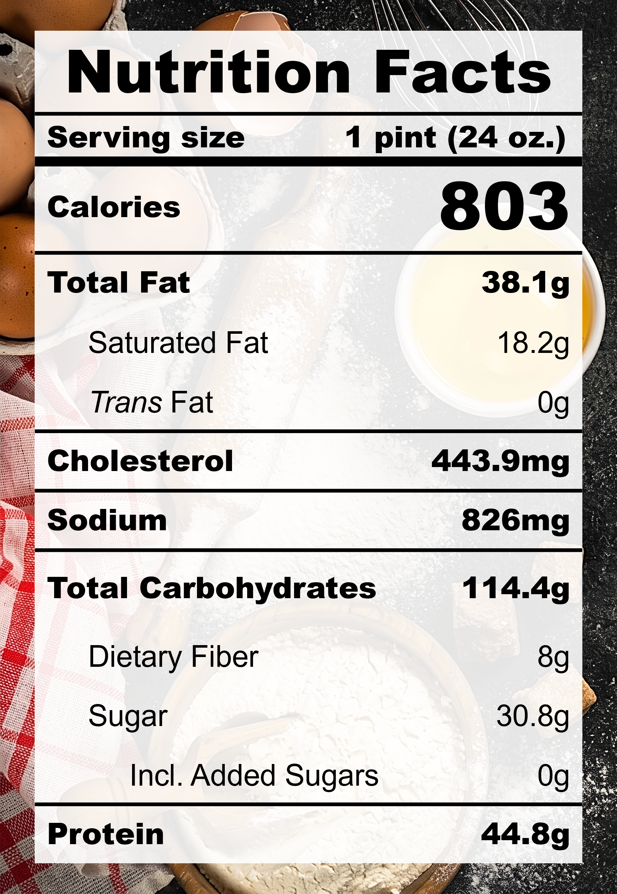

| **Taste** | **Macros** | **Ease** |
| :---: | :---: | :---: |
| ★★★★☆ | ★★☆☆☆ | ★★☆☆☆ | 

## Recipe

**Ingredients for a 24-oz pint:**
- Sweet corn kernels (2 cups / cut from ~2 cobs)
- Butter, unsalted (2 tbsp)
- Salt (&frac14; tsp)
- Cinnamon (1 tsp)
- Milk, 0% fat, ultra-filtered (1 &frac23; cups)
- Soft tofu (125 g)
- Egg yolk (2 yolks)
- Monkfruit sweetner with allulose (&frac14; cup)
- Xanthan gum (&frac14; tsp)
- Lemon juice (2 tsp)
- Vanilla extract, pure (1 tsp)

**Instructions:**
1. For fresh sweet corn, slice the kernels off the cobs and scrap the cob to collect the "corn milk".
2. Melt the butter in a small pot over medium heat until foaming.
3. Add the sweet corn kernels, scrapings, salt, and cinnamon. Saute for 5 minutes.
4. Pour in the milk and simmer for 15 minutes on low heat.
5. Remove the mixture from heat. Add soft tofu, egg yolks, sweetner, and xanthan gum. Blend until smooth.
6. Bring the mixture back onto low heat. Stir contantly while scraping the bottom until the mixture thickens.
7. Remove the mixture from heat. Add in lemon juice and vanilla extract. Stir to mix.
8. Freeze for 24 hours.
9. Spin on LITE ICE CREAM (push down and re-spin with a splash of milk if needed).

## Nutrition Facts

## Reflections

**Overall Rating:** ★★★☆☆

This pint tastes just like a sweet corn tofu pudding (douhua) that you might find in a Chinese dessert shop. I think my momma would approve (not too sweet)! This is the first recipe to make the list for Zebby's Pick! Fantastic aroma, flavour, and texture.

**The Good (what went well):**
- Fragrant buttery sweet corn: The toasting and steeping steps do the heavy-lifting to draw out the essence of corn.
- Butter: Real butter brings an irreplaceable level of depth to the flavour.

**The Bad (lessons learned):**
- The flavour was a bit flat: More salt, acidicity, and spices (e.g. cinnamon, cardamom, or nutmeg) would provide some balance.
