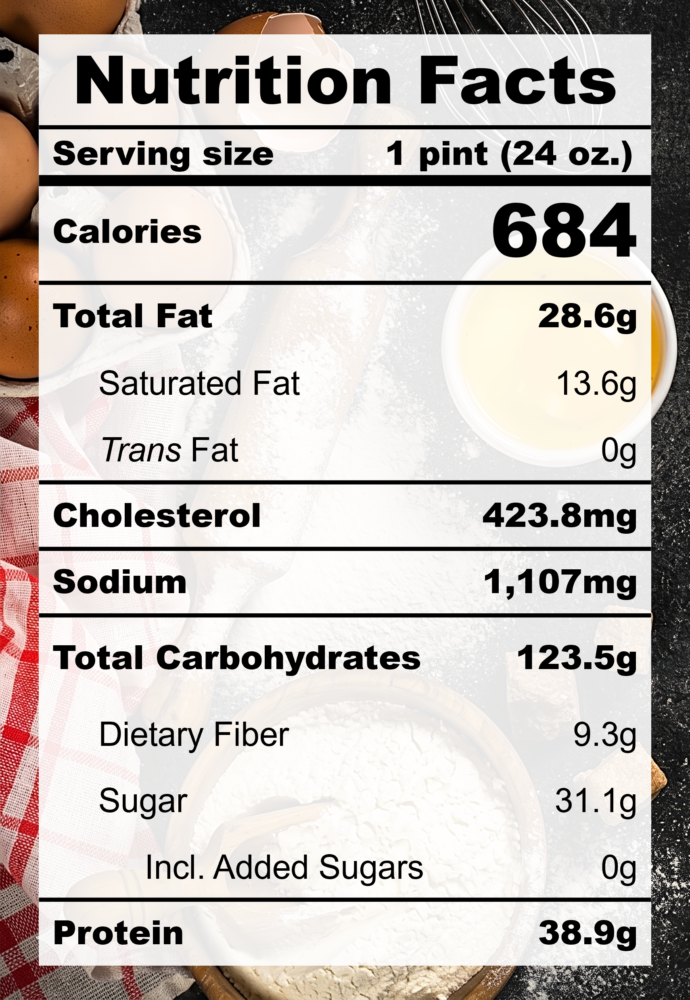

| **Taste** | **Macros** | **Ease** |
| :---: | :---: | :---: |
| ★★★☆☆ | ★★★☆☆ | ★★☆☆☆ | 

## Recipe

**Ingredients for a 24-oz pint:**
- Sweet corn kernels (2 cups / cut from ~2 cobs)
- Butter, unsalted (1 &frac13; tbsp)
- Salt (&frac38; tsp)
- Cinnamon (2 tsp)
- Milk, 0% fat, ultra-filtered (1 &frac23; cups)
- Egg yolk (2 yolks)
- Monkfruit sweetner with allulose (&frac14; cup)
- Xanthan gum (&frac14; tsp)
- Lemon juice (1 tbsp)
- Vanilla extract, pure (1 tsp)

**Instructions:**
1. For fresh sweet corn, slice the kernels off the cobs and scrap the cob to collect the "corn milk".
2. Melt the butter in a small pot over medium heat until foaming.
3. Add the sweet corn kernels, scrapings, salt, and cinnamon. Saute for 5 minutes.
4. Pour in the milk and simmer for 15 minutes on low heat.
5. Remove the mixture from heat. Add egg yolks, sweetner, and xanthan gum. Blend until smooth.
6. Bring the mixture back onto low heat. Stir contantly while scraping the bottom until the mixture thickens.
7. Remove the mixture from heat. Add in lemon juice and vanilla extract. Stir to mix.
8. Freeze for 24 hours.
9. Spin on ICE CREAM (push down and re-spin if needed).

## Nutrition Facts

## Reflections

**Overall Rating:** ★★★☆☆

This flavour combination was a fun surprise, it tastes a little like Cinnamon Toast Crunch X Frosted Flakes. While I enjoyed the warmth of this pint, I think I preferred the previous version of this recipe that was more pudding-like and had a strong corn aroma.

**The Good (what went well):**
- A little extra lemon juice: Trust the process! Right after I added a whole tablespoon of lemon juice, I thought I seriously messed up. The acidity overpowered everything! However, flavours change when they freeze and the final product was perfectly bright and balanced.

**The Bad (lessons learned):**
- Cinnamon overpowered corn: For the cinnamon lovers, this might not even be a bad thing. But, my vision for this recipe was corn-focused, and this one was just too cinnamon-y.
- Icy texture: Bring back the tofu, don't skimp on the butter.
