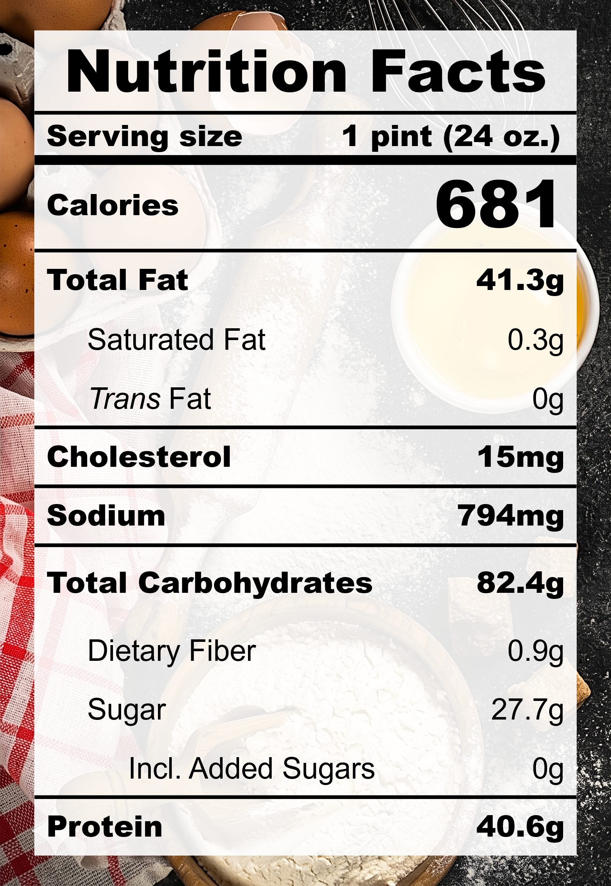

| **Taste** | **Macros** | **Ease** |
| :---: | :---: | :---: |
| ★★★☆☆ | ★★★☆☆ | ★★★☆☆ | 

## Recipe

**Ingredients for a 24-oz pint:**
- Sesame seeds, black, roasted (60 g)
- Milk, 0% fat, ultra-filtered (1 &frac12; cups)
- Miso, white, reduced-sodium (2 tsp)
- Silken tofu (150 g)
- Sesame oil (&frac12; tsp)
- Almond Extract (&frac14; tsp)
- Salt (&frac18; tsp)
- Honey (1 tbsp)
- Monkfruit sweetner with allulose (&frac14; cup)
- Xanthan gum (&frac14; tsp)
- Vanilla extract, pure (1 tsp)
- Lemon juice (1 tsp)

**Instructions:**
1. Microwave the sesame seeds in milk until hot. Steep for 15 minutes to soften the hull and fully infuse the sesame flavour into the milk.
2. Blend everything except lemon juice together.
3. Stir in the lemon juice.
4. Freeze for 24 hours.
5. Spin on ICE CREAM.
6. Push down and re-spin with a splash of milk.

## Nutrition Facts

## Reflections

**Overall Rating:** ★★★☆☆

Inspired by black sesame glutinuous rice balls (tangyuan), this recipe went heavy on the sesame taste and aroma. The tofu was added for body but it really didn't work with the nutty flavour profile. I am a huge fan of sesame and will definitely try this one again.

**The Good (what went well):**
- Rich sesame aroma: Sesame oil was a great touch.

**The Bad (lessons learned):**
- The texture was gummy: The xanthan gum was too much. This recipe probably doesn't need it.
- Too beany and not enough nutty: Tofu synergizes with grassy and starchy foods (e.g., corn, sweet potato, red bean) and not so much with roasted and fermented foods (e.g., sesame, coffee, caramel). In an attempt to boost the nuttiness with almond extract, I went a little overboard with it and the aftertaste became slightly bitter. No tofu or almond extract next time.
- The acidity was too bright: Lemon juice is quite powerful. Use something more subtle like rice vinegar.
