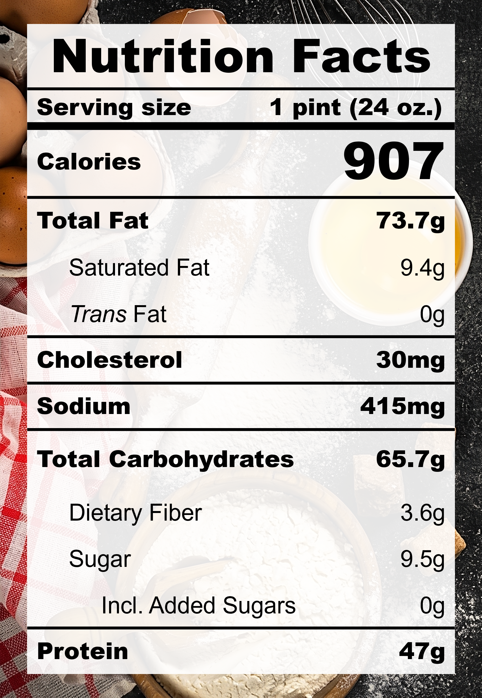

| **Taste** | **Macros** | **Ease** |
| :---: | :---: | :---: |
| ★★★★☆ | ★★★☆☆ | ★★★☆☆ | 

## Recipe

**Ingredients for a 24-oz pint:**
- Sesame seeds, black, roasted (70 g)
- Milk, 2% fat, ultra-filtered (1 &frac12; cups)
- Silken tofu (170 g)
- Miso, white, reduced-sodium (&frac12; tbsp)
- Walnut (20 g)
- Sesame oil (&frac12; tsp)
- Golden monkfruit sweetner with allulose (&frac14; cup)

**Instructions:**
1. Microwave the sesame seeds in milk until hot. Steep for 15 minutes to soften the hull and fully infuse the sesame flavour into the milk.
2. Blend everything together.
3. Freeze for 24 hours.
4. Spin on LITE ICE CREAM (push down and re-spin with a splash of milk if needed).

## Nutrition Facts

## Reflections

**Overall Rating:** ★★★★☆

Turns out I was wrong last time. Tofu wasn't the culprit to the wet-earth flavours in the previous recipe: it was the lemon juice and almond extract that created a very distracting combination. This pint leans more into nutty flavours and natural fats. The macros are a bit lacking but it was very delicious.

**The Good (what went well):**
- Less is more: Cutting down on flavour enhancers and focusing on a pure sesame base created a singlular, strong flavour profile.
- Walnuts for buttery texture: Fat is flavour! Perhaps the walnuts added too much fat but the texture was amazing.

**The Bad (lessons learned):**
- Chewy sesame bits: This one is more about personal taste. The bits of sesame that didn't fully blend into the mixture was a bit bitter and chunky for me, while Zebby really enjoyed the texture. To each their own!

