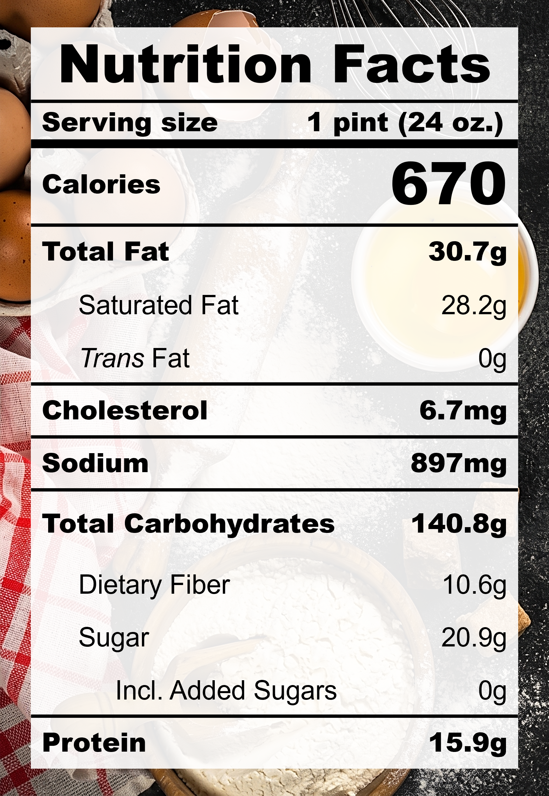

| **Taste** | **Macros** | **Ease** |
| :---: | :---: | :---: |
| ★★★★☆ | ★☆☆☆☆ | ★★★☆☆ | 

## Recipe

**Ingredients for a 24-oz pint:**
- Purple sweet potato (2 medium / 342 g)
- Coconut milk, unsweetened (200 ml)
- Milk, 0% fat, ultra-filtered (&frac23; cups)
- Salt (&frac14; tsp)
- Monkfruit sweetner with allulose (&frac13; cup)
- Vanilla extract, pure (1 tsp)

**Instructions:**
1. Wrap the purple sweet potato with a wet paper towel and microwave for 5 minutes. Flip the potato and microwave for another 2–4 minutes until a fork can easily pierce through. 
2. Blend everything together.
3. Freeze for 24 hours.
4. Spin on ICE CREAM (push down and re-spin with a splash of milk if needed).

## Nutrition Facts

## Reflections

**Overall Rating:** ★★★☆☆

Okay, first things first, purple sweet potato and ube are not the same thing! Ube grows on a vine and has bark-like skin while sweet potatoes are tubers that grow underground. However, I think this was a really close attempt! The rich, roasted, starchy undertones of the sweet potato was suprisingly comforting.

**The Good (what went well):**
- Vanilla: Brought a subtle sweetness that mimicked the natural fragrance of ube.
- Classic coconut pairing: Need I say more? Coconut milk immediately brings the tropical vibes.

**The Bad (lessons learned):**
- Gummy texture: Sweet potatoes are quite starchy. Microwaving heats up too fast and doesn't give time for naturally occurring enzymes (amylases) to break down starches into sugars. Bake/roast the sweet potato next time and use less of it. Also mix/blend gently to avoid overworking the starches.
