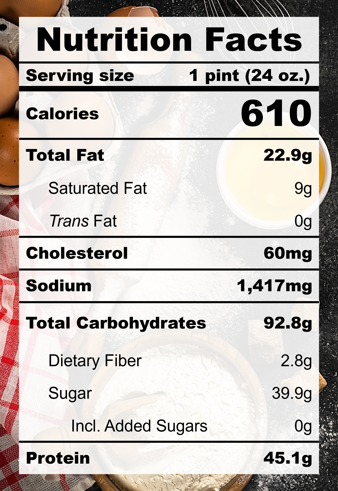

| **Taste** | **Macros** | **Ease** |
| :---: | :---: | :---: |
| ★★★☆☆ | ★★★★☆ | ★★★★☆ | 

## Recipe

**Ingredients for a 24-oz pint:**
- Cottage cheese, low fat (1 cup)
- Milk, 2% fat, ultra-filtered (1 &frac12; cups)
- Miso, white, reduced-sodium (&frac12; tbsp)
- Monkfruit sweetner with allulose (3 tbsps)
- Instant pudding, pistachio (24 g / ~&frac14; package)
- Pistachios (25 g)

**Instructions:**
1. Blend everything except pistachios together.
3. Freeze for 24 hours.
4. Spin on LITE ICE CREAM.
5. Add in pistachios and spin on MIX-IN.

## Nutrition Facts

## Reflections

**Overall Rating:** ★★★★☆

Pistachio might be one of my favourite ice cream / gelato flavours. This one was also inspired by the delicious layer of creamy cheese foam that you might find in bubble teas. This was delicious, silky, and Mum Approved. I enjoyed it but I also have very high standards for pistachio.

**The Good (what went well):**
- Good texture and protein: Cottage cheese is already a powerfood in itself! It provides great macros (relatively low calories and high protein) and structure for a silky smooth base.

**The Bad (lessons learned):**
- Chunky nuts: The pistachios stayed strong through the MIX-IN spin cycle and stayed mostly in tact. For a more evenly distributed flavour and smoother texture, the pistachios could be lightly crushed beforehand or blended into the mixture.