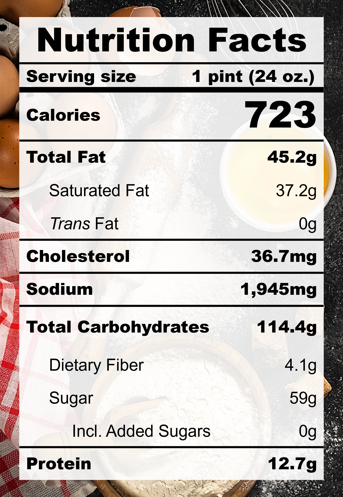

| **Taste** | **Macros** | **Ease** |
| :---: | :---: | :---: |
| ★★★★★ | ☆☆☆☆☆ | ★★★★☆ | 

## Recipe

**Ingredients for a 24-oz pint:**
- Mango, fresh (3 medium / 259 g)
- Coconut milk, unsweetened (200 ml)
- Coconut Melona (1 bar)
- Cream cheese, light (&frac14; cup)
- Milk, 2% fat, ultra-filtered (&frac13; cup)
- Salt (&frac58; tsp)
- Monkfruit sweetner with allulose (&frac14; cup)

**Instructions:**
1. Blend everything together.
2. Freeze for 24 hours.
3. Spin on ICE CREAM (push down and re-spin with a splash of milk if needed).

## Nutrition Facts

## Reflections

**Overall Rating:** ★★★★☆

Absolutely WOW! It's refreshing, satiating, and oh so satisfying! We won't look at the macros for this one—it's a well deserved treat. This one is making Celine's Choice and Zebby's Pick!

**The Good (what went well):**
- Load up the mangoes: The tropical mango flavour really came through! About half the pint was filled with mangoes before blending.
- Salt is the bridge: This recipe calls for A LOT of salt! Don't be afraid! It really ties the entire flavour together.

**The Bad (lessons learned):**
- Slightly icy texture: The only thing missing from this pint is that incredibly smooth and creamy texture. Perhaps simmering the mango puree would reduce the water bound by fruit fibers.
