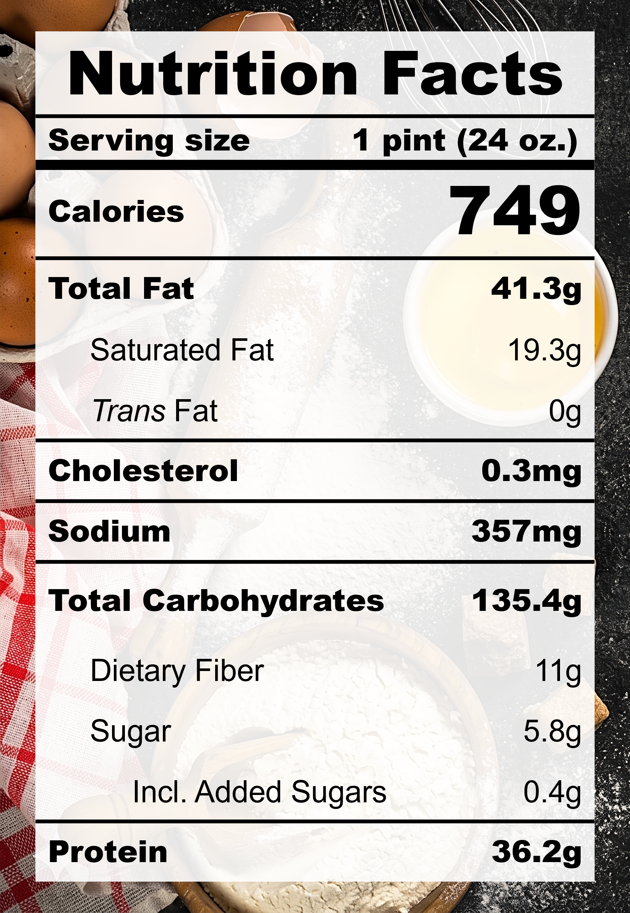

| **Taste** | **Macros** | **Ease** |
| :---: | :---: | :---: |
| ★★★☆☆ | ★★☆☆☆ | ★★☆☆☆ | 

## Recipe

**Ingredients for a 24-oz pint:**
- Adzuki beans (70 g)
- Coconut milk, unsweetened (100 ml)
- Silken tofu (170 g)
- Soy beverage, unsweetened (1 &frac14; cups)
- Miso, white, reduced-sodium (1 tsps)
- Golden monkfruit sweetner with allulose (&frac38; cup)
- Almond extract (&frac18; tsp)
- Lemon juice (1 tsp)
- Almond, chopped (25 g)
- Crispy coconut roll, crushed (1 roll)

**Instructions:**
1. Cook raw adzuki beans in water until soft. Alternatively, red bean paste can be used directly in step 2.
2. Blend everything except chopped almonds and crispy coconut roll together.
3. Freeze for 24 hours.
4. Spin on LITE ICE CREAM (push down and re-spin if needed).
5. Add in almonds and spin on MIX-IN.
6. *Optional:* Sprinkle on crispy coconut roll flakes and serve immediately.

## Nutrition Facts

## Reflections

**Overall Rating:** ★★★☆☆

I've been wanting to experiment with red bean in ice cream for a while now! Red bean is such a classic Asian dessert filling and very nostalgic for me. This pint is subtly sweet and flavourful. The crunch from the almond is also very fun.

**The Good (what went well):**
- Red bean is a power food: High protein, high fiber, antioxidants, and minerals. What more can an ice cream ask for!

**The Bad (lessons learned):**
- Complicated and clashing flavours: I wanted to brighten the flavours a bit but the lemon juice seems to have clashed with the earthy flavours.
- Almond extract: The mix of miso and almond extract can create a medicinal flavour. Almond extract is super strong and can be reduced to perhaps a couple of drops.