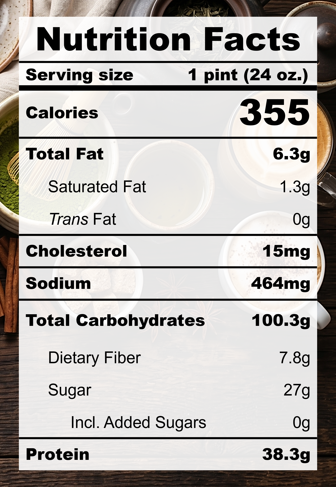

| **Taste** | **Macros** | **Ease** |
| :---: | :---: | :---: |
| ★★★★☆ | ★★★★★ | ★★★★☆ | 

## Recipe

**Ingredients for a 24-oz pint:**
- Matcha powder (1 &frac12; tbsp)
- Milk, 0% fat, ultra-filtered (1 &frac12; cups)
- Silken tofu (212.5 g)
- Salt (&frac18; tsp)
- Honey (1 tbsp)
- Monkfruit sweetner with allulose (&frac13; cup)
- Xanthan gum (&frac14; tsp)
- Vanilla extract, pure (1 tsp)

**Instructions:**
1. Blend everything together.
2. Freeze for 24 hours.
3. Spin on LITE ICE CREAM (push down and re-spin if needed).

## Nutrition Facts

## Reflections

**Overall Rating:** ★★★★★

Wow! This pint was so tasty and the macros are amazing! It tastes just like a matcha latte soft-serve. This one is going on Celine's Choice.

**The Good (what went well):**
- Not too sweet: &frac13; cup sweetner with honey sounds like a lot but it turned out really balanced. The floral honey elevated the earthiness of the matcha.
- Very mucha matcha: The matcha taste was strong! Matcha lovers can add &frac12;–1 tbsp more for an extra-rich pint.

**The Bad (lessons learned):**
- A smidge too beany: The tofu taste was a bit stronger than I envisioned, and it tasted like a matcha latte with soy-milk substitute. Add less tofu for the next one and some more fat.
