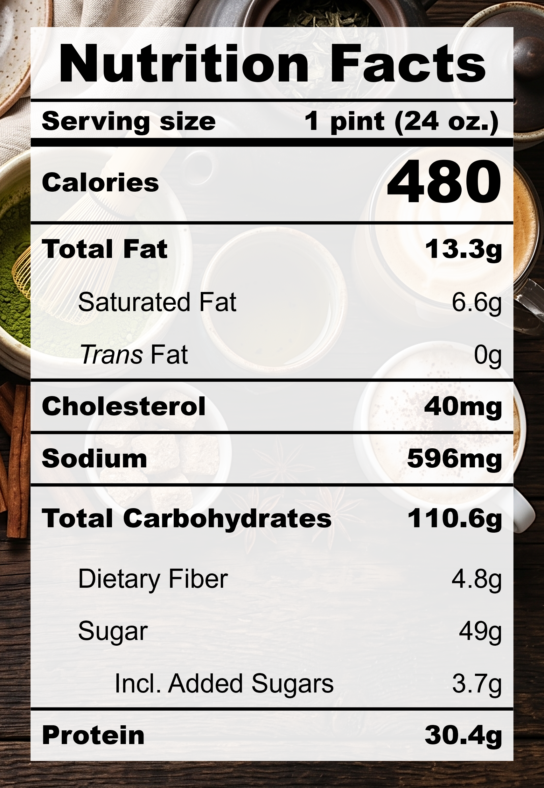

| **Taste** | **Macros** | **Ease** |
| :---: | :---: | :---: |
| ★★★★☆ | ★★★★☆ | ★★★★☆ |

## Recipe

**Ingredients for a 24-oz pint:**
- Earl Grey (3 tea bags)
- Milk, 2% fat, ultra-filtered (2 cups)
- Lychee, fresh (215 g / ~10)
- Salt (&frac18; tsp)
- Monkfruit sweetner with allulose (&frac14; cup)
- Xanthan gum (&frac14; tsp)
- Lemon juice (1 tsp)

**Instructions:**
1. Steep the Earl Grey tea bags in milk over medium heat for ~15 minutes.
2. Remove the tea bags and let the mixture cool.
3. Blend everything together.
4. Freeze for 24 hours.
5. Spin on ICE CREAM (push down and re-spin with a splash of milk if needed).

## Nutrition Facts

## Reflections

**Overall Rating:** ★★★★☆

Summer is the season of fresh fruits and lychees are one of my all time favourites! The combination of the bergamot in Earl Grey and the fresh florals in lychee is such a bubble tea classic. IYKYK!

**The Good (what went well):**
- Layers of flavour: The bright florals of the lychee hits strong upfront, followed by the deeper and richer Earl Grey tea. Steeping the tea was definitely worth the effort!

**The Bad (lessons learned):**
- Icy texture: There's not enough body in this recipe. Lychees are mostly water and there's just not a lot of substance holding it together. Add more fat or stabilizers next time.
