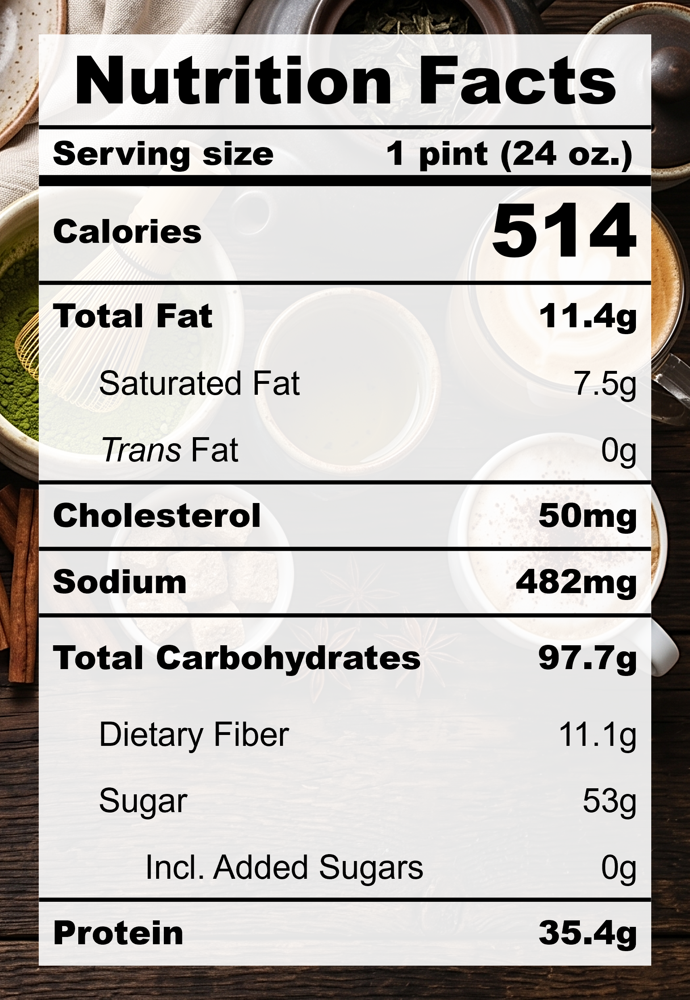

| **Taste** | **Macros** | **Ease** |
| :---: | :---: | :---: |
| ★★★★☆ | ★★★★★ | ★★★★☆ |

## Recipe

**Ingredients for a 24-oz pint:**
- Espresso, instant (10.8 g / ~2 tbsps)
- Dates, pitted (60 g / ~10 small)
- Milk, 2% fat, ultra-filtered (2 &frac12; cups)
- Miso, white, reduced-sodium (1 tsp)
- Golden monkfruit sweetner with allulose (2 tbsps)
- Xanthan gum (&frac14; tsp)
- Vanilla extract, pure (1 tsp)

**Instructions:**
1. Blend everything together.
2. Freeze for 24 hours.
3. Spin on LITE ICE CREAM (push down and re-spin with a splash of milk if needed).

## Nutrition Facts

## Reflections

**Overall Rating:** ★★★★★

There's almost nothing I would change about this pint (immediate winner for Celine's Choice)! Every rich and creamy bite is accompanied by the aroma of freshly pulled espresso.

**The Good (what went well):**
- Decaf espresso: Enjoy the pint at night by using decaf instant espresso! It tastes just as good without the worry of caffeine too close to bedtime.

**The Bad (lessons learned):**
- More flavour layers: The strong coffee taste is amazing, but could be a bit flat. A little more sugar and salt would help round it out.

