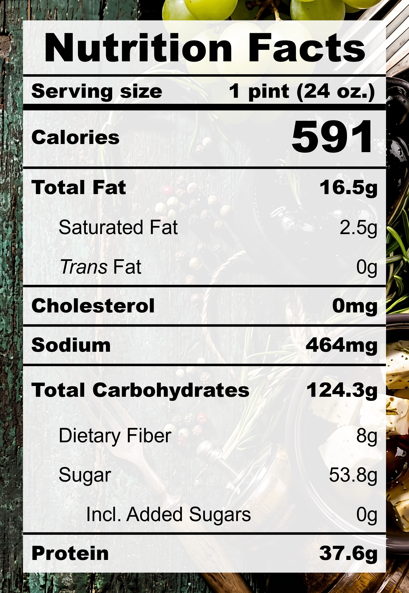

| **Taste** | **Macros** | **Ease** |
| :---: | :---: | :---: |
| ★★★☆☆ | ★★★★☆ | ★★☆☆☆ | 

## Recipe

**Ingredients for a 24-oz pint:**
- Ginger (50 g + 15 g)
- Jujube dates, dried (50 g)
- Brown sugar (2 tbsps)
- Soy beverage, unsweetened (2 &frac12; cups)
- Silken tofu (212.5 g)
- Miso, white, reduced-sodium (1 tsp)
- Monkfruit sweetner with allulose (&frac14; cup)

**Instructions:**
1. For fresh sweet corn, slice the kernels off the cobs and scrap the cob to collect the "corn milk".
2. Melt the butter in a small pot over medium heat until foaming.
3. Add the sweet corn kernels, scrapings, salt, and cinnamon. Saute for 5 minutes.
4. Pour in the milk and simmer for 15 minutes on low heat.
5. Remove the mixture from heat. Add egg yolks, sweetner, and xanthan gum. Blend until smooth.
6. Bring the mixture back onto low heat. Stir contantly while scraping the bottom until the mixture thickens.
7. Remove the mixture from heat. Add in lemon juice and vanilla extract. Stir to mix.
8. Freeze for 24 hours.
9. Spin on ICE CREAM (push down and re-spin if needed).

## Nutrition Facts

## Reflections

**Overall Rating:** ★★★☆☆

**The Good (what went well):**

**The Bad (lessons learned):**
