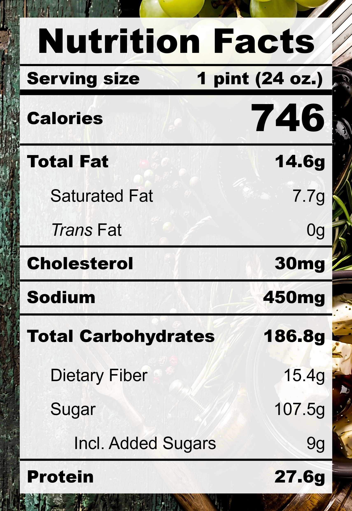

| **Taste** | **Macros** | **Ease** |
| :---: | :---: | :---: |
| ★★★★☆ | ★★★☆☆ | ★★☆☆☆ | 

## Recipe

**Ingredients for a 24-oz pint:**
- Japanese sweet potato (315g / ~6 medium)
- Cocoa powder (3 tbsps)
- Cinnamon, ground (&frac14; tsp)
- Miso, white, reduced-sodium (1 tsp)
- Milk, 2% fat, ultra-filtered (1 &frac12; cups)
- Golden monkfruit sweetner with allulose (&frac14; cup)
- Xanthan gum (&frac18; tsp)
- Lotus Biscoff cookies (2 cookies)

**Instructions:**
1. Poke the sweet potatoes with a fork and bake at 375&deg;F for 45–60 minutes until it can be easily pierced.
2. Let the sweet potatoes cool and peel.
3. Blend everything except the Lotus Biscoff cookies together.
4. Freeze for 24 hours.
5. Spin on LITE ICE CREAM.
6. Add in the Lotus Biscoff cookies and spin on MIX-IN.

## Nutrition Facts

## Reflections

**Overall Rating:** ★★★☆☆

Roasted sweet potatoes and s'mores by the campfire is one of my summer core memories. This pint is chocolatey, sweet, thick, and smokey. The mixed in cookies also add a great crunch to the texture.

**The Good (what went well):**
- Baked sweet potatoes make great bases: The texture is so smooth and creamy, thick like a Wendy's Frosty. It's very satisfying to eat.
- A touch of cinnamon: The cinnamon brought the flavours together by bridging the sweet and savoury.

**The Bad (lessons learned):**
- The cookies still crumbled: The Lotus Biscoff cookies completely shattered again. I thought they would be okay this time since I kept them whole during the MIX-IN spin. It seems like they need to be either pre-frozen, added on the side of the pint instead of the middle, or mixed in by hand.
