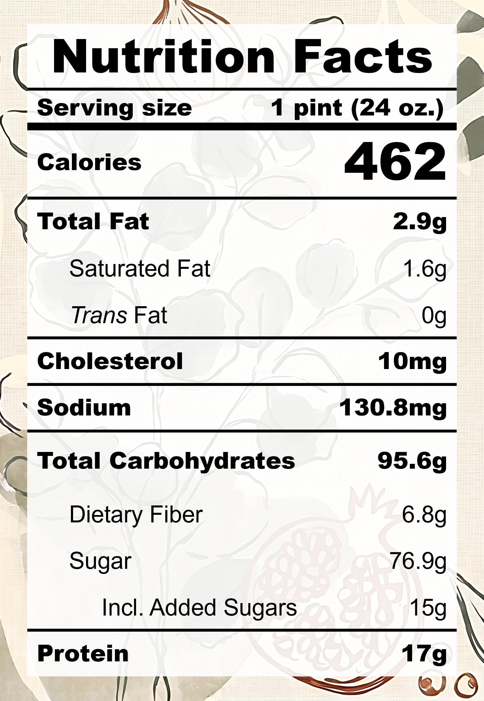

## Overview

The very very first pint! I love a good fruit smoothie and thought that I could test out the "Creamify Technology" by churning a frozen smoothie into ice cream. Turns out, it's not quite a 1:1 translation.

**The Good (what went well):**
- The texture was really smooth and creamy: Make sure the pint is fully frozen and push down the ice before re-spinning.

**The Bad (lessons learned):**
- The taste was very bland: Add more sugar and fat.
- There was a slightly bitter after-taste: The bromelain inside pineapples breaks down milk proteins into bitter peptides. Either cook the pineapples, use canned pineapples, or use milk-alternatives.
- No blueberry flavour: Yeah, that's my bad. I just really like blueberries, but it's really an odd ingredient in pina colada. Save the blueberries for smoothies.

**Overall Rating:** ★★★☆☆

| **Taste** | **Macros** | **Ease** |
| :---: | :---: | :---: |
| ★★☆☆☆ | ★★★☆☆ | ★★★★☆ | 

## Recipe

**Ingredients for a 24-oz pint:**
- Pineapple, frozen (200 g)
- Blueberry, frozen (100 g)
- Banana (1 small / 63 g)
- Coconut Melona (1 bar)
- Milk, 0% fat, ultra-filtered (1 cup)
- Honey (1 tbsp)

**Instructions:**
- Blend everything together
- Freeze for 24 hours
- Spin on LITE ICE CREAM (push down and re-spin if needed)

## Nutrition Facts

