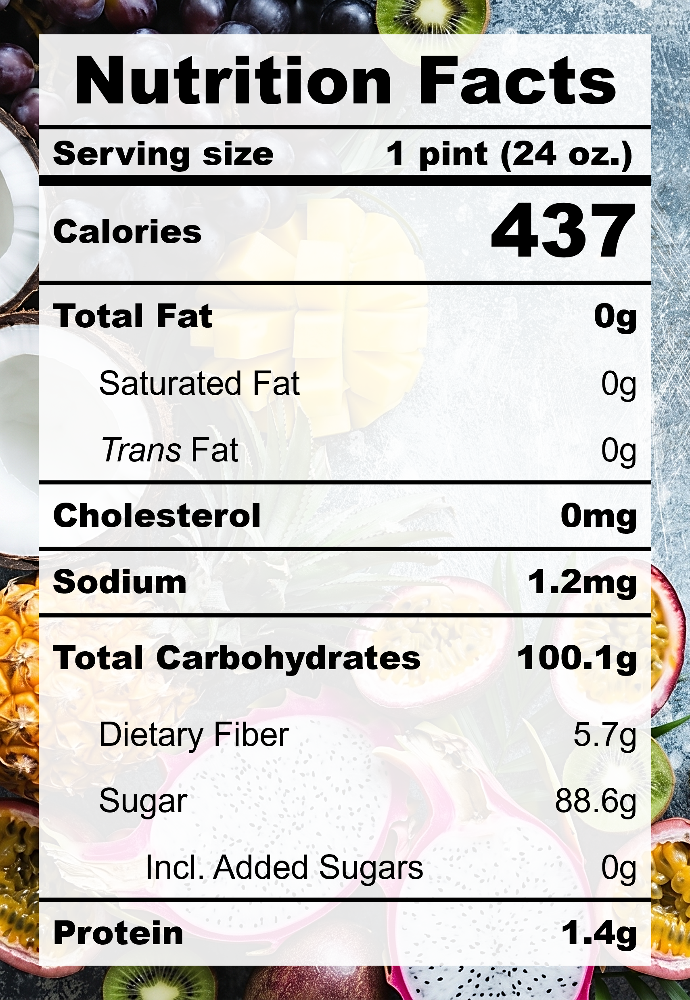

| **Taste** | **Macros** | **Ease** |
| :---: | :---: | :---: |
| ★★☆☆☆ | ★☆☆☆☆ | ★★★★★ | 

## Recipe

**Ingredients for a 24-oz pint:**
- Mango juice (275 ml)
- Pineapple, frozen (400 g)

**Instructions:**
1. Pour ingredients into the pint, make sure the mango juice covers the pineapples and the total volume stays under the max-fill line 
2. Freeze for 24 hours.
3. Spin on SORBET (push down and re-spin if needed).

## Nutrition Facts

## Reflections

**Overall Rating:** ★★★☆☆

**The Good (what went well):**

**The Bad (lessons learned):**
