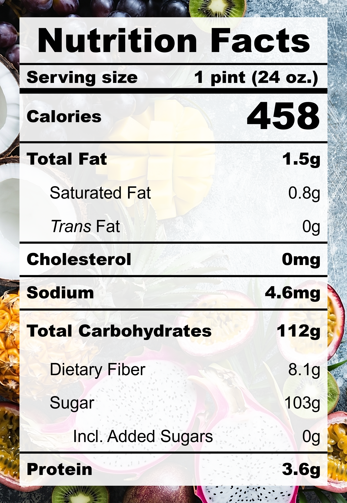

| **Taste** | **Macros** | **Ease** |
| :---: | :---: | :---: |
| ★★★★★ | ★☆☆☆☆ | ★★★★☆ | 

## Recipe

**Ingredients for a 24-oz pint:**
- Mango, fresh (3 medium / 384 g)
- Pineapple, frozen (140 g)
- Mango juice (177 ml)
- Honey (&frac12; tbsp)

**Instructions:**
1. Blend everything together.
2. Freeze for 24 hours.
3. Spin on SORBET (push down and re-spin if needed).

## Nutrition Facts

## Reflections

**Overall Rating:** ★★★★☆
The mango pineapple sorbet recipe got a glow up! This iteration adds fresh mangoes and a spoonful of honey to create a smooth, velvety texture. It's sweet, refreshing, and surprisingly light.

**The Good (what went well):**
- Fresh mangoes provide flavour and texture: The extra fibers from the mango provided body and wonderful flavours.
- Honey for smooth texture: Sugars help to reduce iciness.

**The Bad (lessons learned):**
- No comments here!

