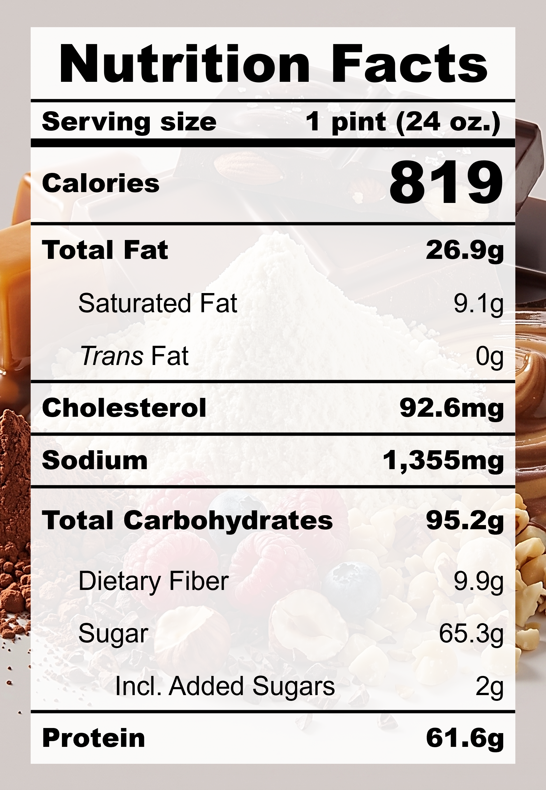

| **Taste** | **Macros** | **Ease** |
| :---: | :---: | :---: |
| ★★★☆☆ | ★★★★☆ | ★★★★☆ | 

## Recipe

**Ingredients for a 24-oz pint:**
- Whey protein, chocolate (1 scoop / 35 g)
- Peanut butter powder (2 tbsp)
- Cocoa powder (2 tbsp)
- Salt (&frac14; tsp)
- Instant pudding, pistachio (22 g)
- Banana (1 small / 68 g)
- Brown sugar, light (1 tbsp)
- Monkfruit sweetner with allulose (1 tsp)
- Greek yogurt, nonfat, plain (150 g)
- Milk, whole (1 &frac14; cup)
- Mixed nuts, crushed (20g)

**Instructions:**
1. Blend everything except nuts together
2. Freeze for 24 hours
3. Spin on LITE ICE CREAM
4. Add in nuts and spin on MIX-IN

## Nutrition Facts

## Reflections

**Overall Rating:** ★★★★☆

Version II of this classic combination. Pistachio instant pudding mix was added for extra flavour and texture. I ran out of 0% ultra-filtered milk and used whole milk instead, which made the ice cream a bit creamier so that was nice. Then I thought to add Greek yogurt to increase the solids volume and protein, but the flavours just didn't work well together this time.

**The Good (what went well):**
- Rich nutty taste and smoother texture: The pistachio instant pudding mix masks the protein powder taste and helps to create a silky smooth texture.

**The Bad (lessons learned):**
- Slight sour taste: This was probably the Greek yogurt. The strong acidity does not pair well with chocolate.
- The ice cream melted way too fast: In an effort to make the creamiest pint, I may have flown too close to the sun. There are a few reasons for this: too much salt, too much sugar, and low fat content.