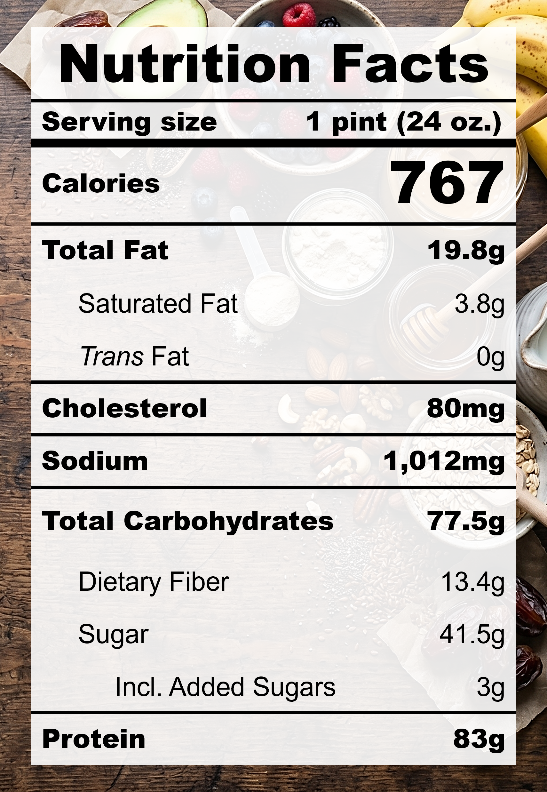

| **Taste** | **Macros** | **Ease** |
| :---: | :---: | :---: |
| ★★★☆☆ | ★★★★★ | ★★★☆☆ | 

## Recipe

**Ingredients for a 24-oz pint:**
- Banana (1 medium / 81 g)
- Whey protein, chocolate (1.5 scoop / 52.5 g)
- Peanut butter powder (3 tbsp)
- Cocoa powder (3 tbsp)
- Salt (&frac18; tsp)
- Instant pudding, pistachio (11 g)
- Monkfruit sweetner with allulose (1 tsp)
- Vanilla extract, pure (1 tsp)
- Milk, 0% fat, ultra-filtered (2 cups)
- Mixed nuts, crushed (20g)

**Instructions:**
1. Slice the banana length-wise and air fry at 390 &deg;F for 15 minutes.
2. Blend everything except nuts together.
3. Freeze for 24 hours.
4. Spin on LITE ICE CREAM.
5. Add in nuts and spin on MIX-IN.

## Nutrition Facts

## Reflections

**Overall Rating:** ★★★★☆

Back again with another chocolate protein ice cream! This time I skipped the greek yogurt, upped the protein by 50%, and upped both the peanut butter and cocoa powders. The taste was pretty good but the texture was... powdery (go figure)!

**The Good (what went well):**
- Amazing macros: Yay for extra protein and relatively low calories.

**The Bad (lessons learned):**
- Chalky texture: The texture was a bit rough and not creamy enough. Perhaps there's too much protein.
- Skip the carmelization: Air-fried bananas are delicious but the flavour didn't come through.
- Blending makes a lot of bubbles and a bump in the center of the pint after freezing: Tap the pint to release the bubbles, let the mixture cool in the fridge before freezing, and check on the pint after freezing for some time and flatten any bumps while it's still malleable (~6 hrs).
