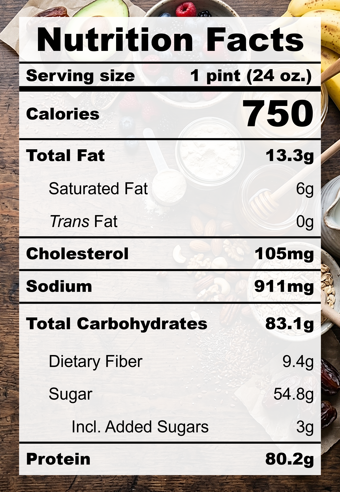

| **Taste** | **Macros** | **Ease** |
| :---: | :---: | :---: |
| ★★★★☆ | ★★★★★ | ★★★★☆ | 

## Recipe

**Ingredients for a 24-oz pint:**
- Whey protein, chocolate (2 scoop / 70 g)
- Banana, ripe (2 large / 258 g)
- Peanut butter powder (3 tbsp)
- Salt (&frac18; tsp)
- Milk, 2% fat, ultra-filtered (1 &frac14; cups)

**Instructions:**
1. Blend everything together.
2. Freeze for 24 hours.
3. Spin on LITE ICE CREAM.

## Nutrition Facts

## Reflections

**Overall Rating:** ★★★★☆

Going back to the basics here. I felt like I was getting too fancy with these protein recipes when they should be easy staples with simple flavours. Re-introducing... a creamy, delicious, and protein-packed pint with chocolate, banana, and peanut butter. My favourite iteration yet!

**The Good (what went well):**
- Creamy and sweet: The two ripe bananas really did the heavy lifting here for that natural sweetness and creamy texture.

**The Bad (lessons learned):**
- Hard to blend: There was a lot going on in that small container. A smooth blend requires patience and constantly scraping the container sides to fully incorporate every ingredient.
